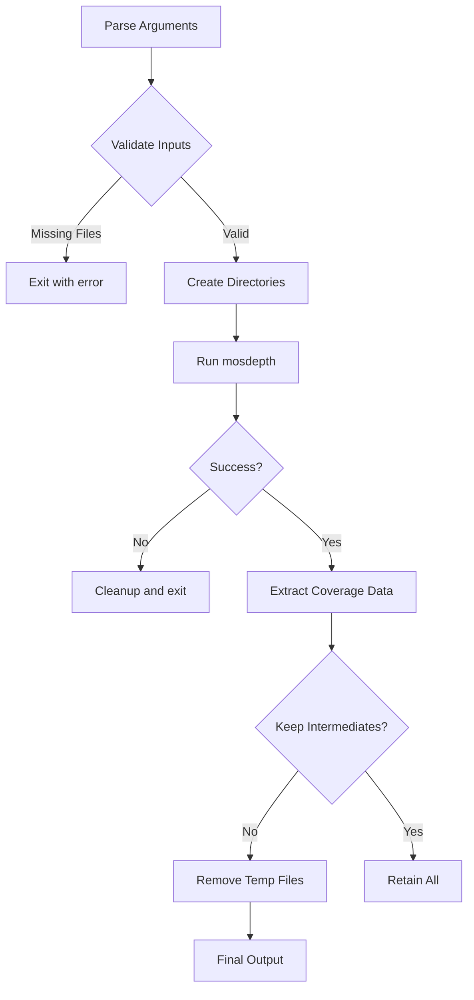

# BED/BAM Processing Pipeline Setup Plan

## Data Sources
Bam:  
https://ftp.ncbi.nlm.nih.gov/ReferenceSamples/giab/data/NA12878/NIST_NA12878_HG001_HiSeq_300x/

Bed:  
https://www.twistbioscience.com/resources/data-files/ngs-human-core-exome-panel-bed-file

## Revised Architecture


## Key Components
1. **Input Validation**  
   - Mandatory BED/BAM path checks
   - Chromosome compatibility verification
2. **Directory Management**  
   - Auto-create Intermediate_Files/ and Result_cov_file/
3. **mosdepth Integration**  
   - Subprocess execution with error handling
4. **Output Processing**  
   - Direct extraction from .regions.bed.gz
   - Preservation of original BED order
5. **Cleanup System**  
   - Conditional removal based on --keep-intermediates

## Input/Output Structure
```
Input:
├── Bed_and_Bam_file/
│   ├── test_fixed.bed
│   └── [input].bam
Output:
├── Intermediate_Files/ (conditional)
│   └── mosdepth outputs
└── Result_cov_file/
    └── [output_prefix].coverage.bed
```

## Implementation Notes
- Python 3.8+ required
- Uses argparse for CLI interface
- Requires pysam for BAM validation
- Implements comprehensive error logging