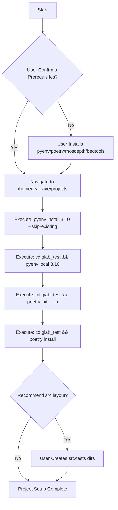

# GIAB Test Project Setup Plan

**Goal:** Configure the `giab_test` directory as a Python project using `pyenv` for Python 3.10 and `poetry` for dependency management. The project will be set up to call externally installed `mosdepth` and `bedtools` tools.

**Prerequisites (User Action Required):**

*   **`pyenv` Installation:** Ensure `pyenv` is installed and correctly configured in your shell environment (including shell hooks like `eval "$(pyenv init -)"`).
*   **`poetry` Installation:** Ensure `poetry` is installed and accessible in your PATH.
*   **`mosdepth` & `bedtools` Installation:** Ensure `mosdepth` and `bedtools` are installed using your system's package manager (e.g., `apt`, `brew`, `conda`) and are available in your system's PATH.

**Plan Steps:**

1.  **Verify Prerequisites (Optional Check):** Run version checks for `pyenv`, `poetry`, `mosdepth`, `bedtools`.
2.  **Navigate to Project Directory:** Ensure all operations occur within `/home/tealeave/projects/giab_test`.
3.  **Install Python 3.10 via `pyenv`:**
    *   Execute `pyenv install 3.10 --skip-existing`.
4.  **Set Local Python Version:**
    *   Execute `cd giab_test && pyenv local 3.10` within the `/home/tealeave/projects` directory.
5.  **Initialize Poetry Project:**
    *   Execute `cd giab_test && poetry init --name giab_test --python "^3.10" -n` within `/home/tealeave/projects`.
6.  **Initial Poetry Environment Setup:**
    *   Execute `cd giab_test && poetry install` within `/home/tealeave/projects`.
7.  **Basic Project Structure (Recommendation):**
    *   Suggest creating a standard Python package structure:
        *   `giab_test/src/giab_test/` directory for source code.
        *   `giab_test/tests/` directory for tests.
        *   An empty `giab_test/src/giab_test/__init__.py` file.

**Visual Plan (Mermaid Diagram):**

**Outcome:**

*   The `giab_test` directory will be configured as a Python project.
*   It will use Python 3.10, managed by `pyenv` (via `.python-version`).
*   Dependencies will be managed by `poetry` (via `pyproject.toml` and `poetry.lock`).
*   A dedicated virtual environment will be created by `poetry`.
*   You'll be ready to write Python code within this structure that can execute `mosdepth` and `bedtools` commands using Python's `subprocess` module.